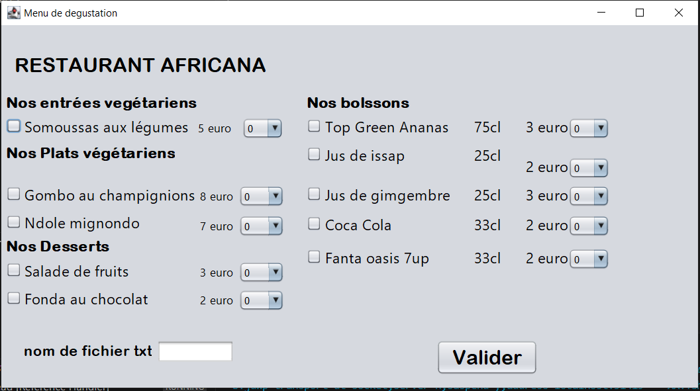

# Système de Commande de Menu Restaurant

## 📌 Description
Application Java avec interface graphique permettant à l’utilisateur de :
- sélectionner un menu parmi plusieurs plats
- valider sa commande
- générer un **fichier .txt récapitulatif** de la commande

## 🚀 Fonctionnalités
- Interface intuitive pour choisir son menu
- Enregistrement automatique des commandes
- Architecture Java orientée objet avec logique métier

## 🛠 Technologies
- Java
- Spring (base de structure)
- Swing

## 📸 Apercu
